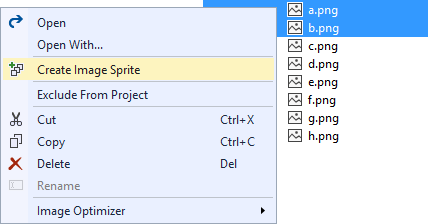
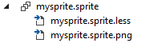
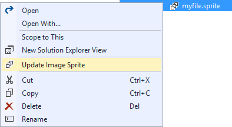

# Image Sprites

[](https://ci.appveyor.com/project/madskristensen/imagesprites)

Download this extension from the [VS Gallery](https://visualstudiogallery.msdn.microsoft.com/8bb845e9-5717-4eae-aed3-1fdf6fe5819a)
or get the [CI build](http://vsixgallery.com/extension/cd92c0c6-2c32-49a3-83ca-0dc767c7d78e/).

---------------------------------------

An image sprite is a collection of images put into a single
image.

A web page with many images can take a long time to load
and generates multiple server requests.

Using image sprites will reduce the number of server
requests and save bandwidth.

This extension makes it easier than ever to create, maintain
and use image sprites in any web project.

See the [changelog](CHANGELOG.md) for changes and roadmap.

## Features

- Easy to create and update image sprites
- Supports png, jpg and gif images
- Configure vertical or horizontal sprite layouts
- Produce LESS, Sass or CSS file with sprite image locations
- [Image Optimizer](https://visualstudiogallery.msdn.microsoft.com/a56eddd3-d79b-48ac-8c8f-2db06ade77c3) integration

### Create image sprite
Select the images in Solution Explorer and click
*Create image Sprite* from the context menu.



This will generate a **.sprite** manifest file as well as
the resulting image file and a LESS stylesheet file.



### The .sprite file
The .sprite file is where information about the image sprite
is stored. It looks like this:

```json
{
	"images": [
		"a.png",
		"b.png"
	],
	"direction": "horizontal",
	"padding": 10,
	"optimize": "lossy",
	"format": "png",
	"stylesheets": {
		"root": "/webroot/img/",
		"formats": [ "less" ]
	}
}
```

**images** is an array of relative file paths to the image
files that make up the resulting sprite file. The order
of the images are maintained in the generated sprite image.

**direction** determines if the images are layed out either
horizontally or vertically. 

**padding** is the distance of whitespace inserted around each
individual image in the sprite. The value is in pixels.

**optimize** controls how the generated image sprite should be
optimized. Choose from *lossless*, *lossy* or *none*. This
feature requires the
[Images Optimizer](https://visualstudiogallery.msdn.microsoft.com/a56eddd3-d79b-48ac-8c8f-2db06ade77c3)
to be installed. 

**stylesheets** outputs LESS, Sass or plain CSS files to make
it easy to use the image sprite in any web project.

Set the **root** property to anything to prefix the path to
the image file in the *url(path)* value.

### Update image sprite
Every time the .sprite file is modified and saved, the image
sprite and optional stylesheets are updated.

A button is also located on the context-menu of .sprite files
to make it even easier.



## Contribute
Check out the [contribution guidelines](.github/CONTRIBUTING.md)
if you want to contribute to this project.

For cloning and building this project yourself, make sure
to install the
[Extensibility Tools 2015](https://visualstudiogallery.msdn.microsoft.com/ab39a092-1343-46e2-b0f1-6a3f91155aa6)
extension for Visual Studio which enables some features
used by this project.

## License
[Apache 2.0](LICENSE)